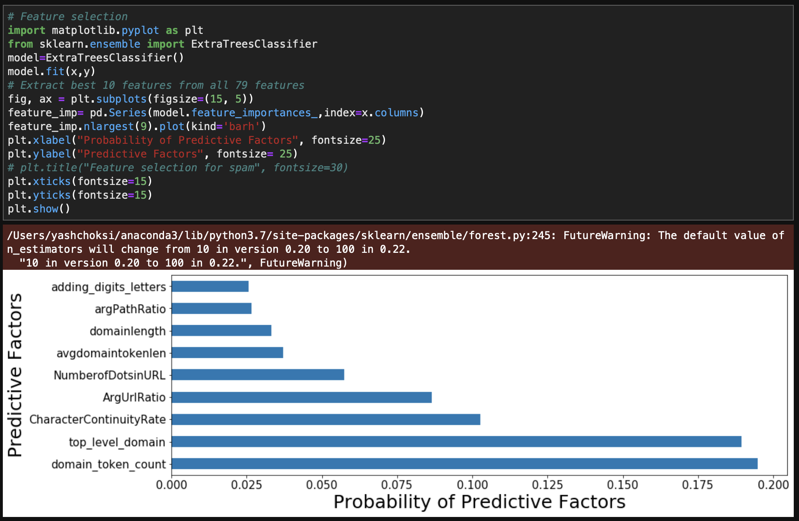
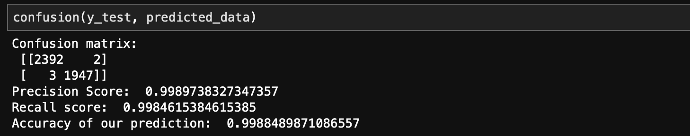

# Cyber security competition
Project presented at Cal Poly Pomona for cyber security competition usinng machine learning. And my team **won first prize from more than 30 teams.**

## Project brief
There were 5 types of attacks have been described in this dataset and we used spam and malware types of attacks dataset urls. By using that we created machine learning model which is based on random forest classifier. There were more than 80 columns and more than 20,000 rows in the dataset. So, feature selection is one of the most important step to address this issue.

## Data cleaning
Data cleaning is essential process in any ML project and yes there were so many data which are either missing or not in proper format. So, we cleaned the data and filled missinng values with mean values of the column. 

## Model
Out of this 80 columns(Features) we selected top 10 features with having highest probability with our target column. And we used extra trees classfier model for this approach to be precise we used feature_importances_ module to get top 10 features with highest probability. As industry standard rule split data in 80% as training and 20% as testing data.

For traning our model we used random forest classifier and we train our data with top 10 features and **score of our model is allmost 99%**.

Finally, for checking accuracy of our model we used precision-recall matrix and using that we measured precision, recall and prediction score which is as below.

## Built with
* Python
* Scikit
* Pandas
* Numpy
* Matplotlib
* Precision-recall matrix

## Authors
* [Yash Choksi](https://www.linkedin.com/in/choksiyash/)
* Tanvi Gidvani
* Aakanksha Tasgaonkar

## Acknowledgements
* [Dataset URL](https://www.unb.ca/cic/datasets/url-2016.html)
* [Project Details](https://www.unb.ca/cic/datasets/url-2016.html)
